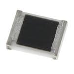
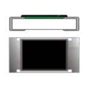
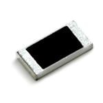
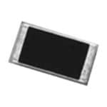

# Mouser Order - Resistors - Low Value 0805 and 1206

**Received:** 2026-02-02
**Orders:** #278499916

## Inventory Summary

| | Part Name | Storage Location | Qty | Order # | Price | Stored |
|--|-----------|------------------|-----|---------|-------|--------|
|  | [1.5Ω Resistor 0805 1% 1/8W](#15ω-resistor-0805-1-18w) | SMD-Box-A1 | 100 | 278499916 | $4.20 | ☐ |
|  | [2.7Ω Resistor 0805 1% 1/8W](#27ω-resistor-0805-1-18w) | SMD-Box-A2 | 100 | 278499916 | $4.20 | ☐ |
|  | [160Ω Resistor 0805 1%](#160ω-resistor-0805-1) | SMD-Box-A3 | 100 | 278499916 | $1.30 | ☐ |
|  | [180Ω Resistor 1206 1% 1/4W](#180ω-resistor-1206-1-14w) | SMD-Box-A4 | 100 | 278499916 | $1.10 | ☐ |
|  | [910kΩ Resistor 0805 1% 1/8W](#910kω-resistor-0805-1-18w) | SMD-Box-A5 | 100 | 278499916 | $2.20 | ☐ |

**Total:** 500 pieces across 5 part types
**Total Cost:** $13.00

---

## Detailed Component Information

### 1.5Ω Resistor 0805 1% 1/8W

**Description:** Anti-sulfur AEC-Q200 thick film chip resistor 0805 1.5 ohm 1% 1/8W

**Specifications:**

- Resistance: 1.5 Ohm
- Tolerance: 1%
- Power Rating: 1/8W
- Package: 0805
- Features: AEC-Q200, Anti-Sulfur

**PartsBox ID:** `c21kw861hcggf907k6c2h3say6`

**PartsBox Link:** <https://partsbox.com/melkor/parts/c21kw861hcggf907k6c2h3say6>

**Storage Location:** `SMD-Box-A1` (ID: `0x9eg3xg6yk2kb0ytf18stvy68`)

**Mouser Link:** <https://www.mouser.com/ProductDetail/Panasonic/ERJ-U06F1R50V>

---

### 2.7Ω Resistor 0805 1% 1/8W

**Description:** Anti-sulfur AEC-Q200 thick film chip resistor 0805 2.7 ohm 1% 1/8W

**Specifications:**

- Resistance: 2.7 Ohm
- Tolerance: 1%
- Power Rating: 1/8W
- Package: 0805
- Features: AEC-Q200, Anti-Sulfur

**PartsBox ID:** `dfx63bdk2ek4gbgtafyycywthg`

**PartsBox Link:** <https://partsbox.com/melkor/parts/dfx63bdk2ek4gbgtafyycywthg>

**Storage Location:** `SMD-Box-A2` (ID: `1217wj0by2gy3ab0trpvqvysx2`)

**Mouser Link:** <https://www.mouser.com/ProductDetail/Panasonic/ERJ-U06F2R70V>

---

### 160Ω Resistor 0805 1%

**Description:** Lead-free thick film chip resistor 0805 160 ohm 1%

**Specifications:**

- Resistance: 160 Ohm
- Tolerance: 1%
- Package: 0805
- Features: Lead Free

**PartsBox ID:** `5w02mf215ygjd8645nw2314dg9`

**PartsBox Link:** <https://partsbox.com/melkor/parts/5w02mf215ygjd8645nw2314dg9>

**Storage Location:** `SMD-Box-A3` (ID: `dh60r8q4jrhm88egy3b790nday`)

**Mouser Link:** <https://www.mouser.com/ProductDetail/Walsin/WR08X1600FTL>

---

### 180Ω Resistor 1206 1% 1/4W

**Description:** General purpose thick film chip resistor 1206 180 ohm 1% 1/4W

**Specifications:**

- Resistance: 180 Ohm
- Tolerance: 1%
- Power Rating: 1/4W
- Package: 1206
- Dielectric: Thick Film

**PartsBox ID:** `ff6fpvt8e8hs682jz9jtpdfp8k`

**PartsBox Link:** <https://partsbox.com/melkor/parts/ff6fpvt8e8hs682jz9jtpdfp8k>

**Storage Location:** `SMD-Box-A4` (ID: `6eez2q20fpjs7ap54y4czzr4yb`)

**Mouser Link:** <https://www.mouser.com/ProductDetail/YAGEO/RC1206FR-07180RL>

---

### 910kΩ Resistor 0805 1% 1/8W

**Description:** AEC-Q200 thick film chip resistor 0805 910k ohm 1% 1/8W

**Specifications:**

- Resistance: 910k Ohm
- Tolerance: 1%
- Power Rating: 1/8W
- Package: 0805
- Features: AEC-Q200

**PartsBox ID:** `cae5a962zejzpawsdkc11b5bnv`

**PartsBox Link:** <https://partsbox.com/melkor/parts/cae5a962zejzpawsdkc11b5bnv>

**Storage Location:** `SMD-Box-A5` (ID: `7tjq9ee3a6g5y8a4a8ngbng2gh`)

**Mouser Link:** <https://www.mouser.com/ProductDetail/YAGEO/AA0805FR-07910KL>

---

## Notes

- **SMD-Box-A1:** 1.5Ω Resistor 0805 (ERJ-U06F1R50V)
- **SMD-Box-A2:** 2.7Ω Resistor 0805 (ERJ-U06F2R70V)
- **SMD-Box-A3:** 160Ω Resistor 0805 (WR08X1600FTL)
- **SMD-Box-A4:** 180Ω Resistor 1206 (RC1206FR-07180RL)
- **SMD-Box-A5:** 910kΩ Resistor 0805 (AA0805FR-07910KL)
- **Stored Column:** Check off (☑) when physically placed in storage location
